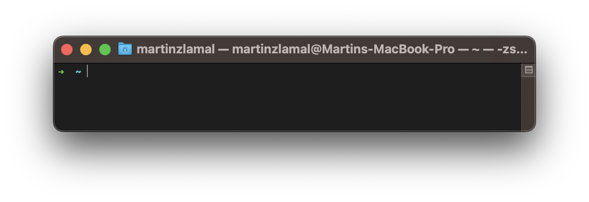
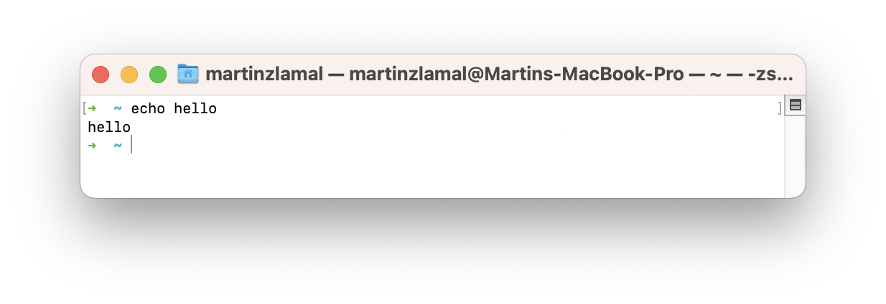
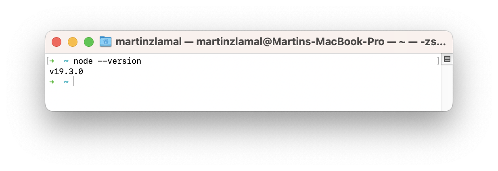
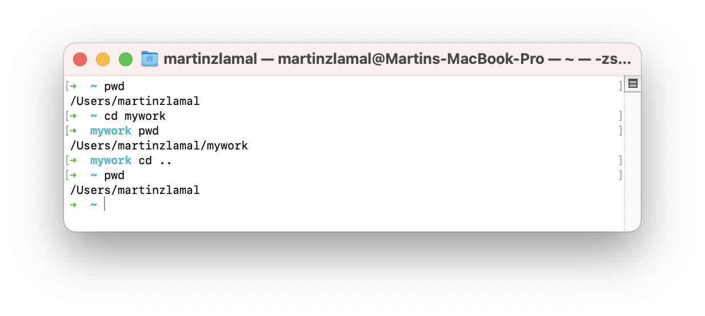
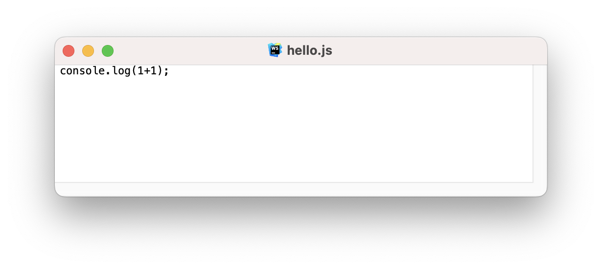
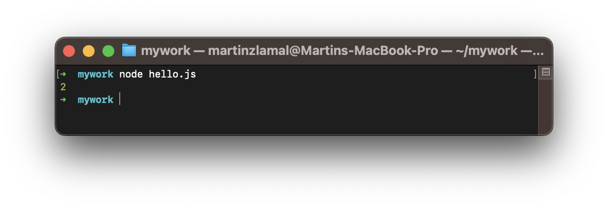

The easiest way to start with programming, specifically with JavaScript language, is to download Node.js (it will allow us to run JavaScript programs from your computer).

Node.js can be downloaded here: https://nodejs.org/en/download/current/

The first step is to download and install the "Windows Installer" or "macOS Installer" based on your computer. Next, we need to verify that everything works as expected. To do so, open a program called `Terminal`. Windows users can install it via https://aka.ms/terminal; macOS users can use Launchpad and type "Terminal" to start it.

For more information, visit:

- Windows: https://learn.microsoft.com/en-us/windows/terminal/
- macOS: https://support.apple.com/guide/terminal/welcome/mac

A Terminal is an application that programmers use to communicate with the computer using text commands. It can have many shapes and colors; this is how it looks on my computer:

It is very simple. The only thing you can do with it is to write some command, and your computer will execute it. Try it:

The command "echo" prints back the text that follows it. After executing the command, the terminal waits for other instructions. Let's verify that our Node.js installation from before was successful by writing `node --version`:

Please note that your version of Node.js and the way your terminal looks might differ. The important thing is whether you obtained some Node.js version. If not, you should investigate a little bit. Maybe you got some error version? In that case, the best thing to do is to use your internet browser and copy-paste there the error in order to search for some responses or tips on what to do.

Get used to this flow: good programmers are good at researching and reading error messages. Try to read and understand what your computer is trying to say via the terminal and search for the responses on the internet if you need more help. It's very common that people encountered the same error before.

Let's learn some more commands that will be essential for our future work: `cd` and `pwd`. Command `pwd` prints our current directory so we don't get lost, and command `cd` navigates into some directory (one step deeper). In the following example, we print our current directory, then go one level deeper into the "mywork" directory and later return one step higher using the special `cd ..` command. Try it:

The easiest way to create new directories is to use your directory browser as you are used to (typically something like right-click and choosing "New folder/directory").

This was very important to learn. All programs live in some directory inside files. In fact, large programs are composed of many, many files (hundreds, thousands, even hundreds of thousands of directories and files). For now, we need to create a `hello.js` file (simply go to your new directory, right-click, and "New file").

It is important to give your file the full name: `hello.js`. The "JS" at the end marks the file as a JavaScript file. Once you have created the file, open it with some primitive text editor (such as Notepad on Windows or TextEdit on macOS) and write the following program: `console.log(1+1);`

Remember to save this file. A common mistake of beginners is to edit files but forget to save their new content. Now, let's go back to our terminal and let's execute this new JavaScript program. We will use the command `node` followed by our filename:

Congratulations! Your first program!

Let's explain it a little bit: `node` is a command that runs (executes) JavaScript files. Inside our JS file, there was a simple program that calculates "1 + 1" and prints/logs the result back into our terminal (commonly also called "console").

That's it for now. Play with the terminal (train `cd` and `pwd`), try to modify your new JavaScript file, and execute it via the `node` command. Learn how things are behaving, and practice more where you made a mistake.
