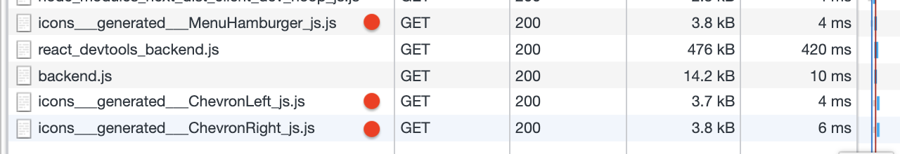
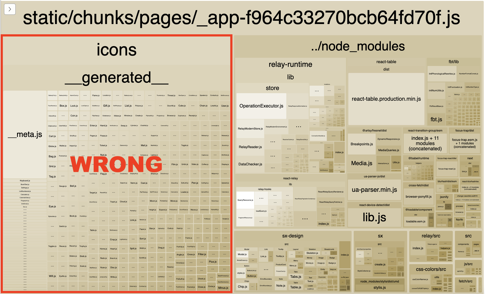

This is a port of awesome [**System UIcons**](https://systemuicons.com/) to be used directly in React. How does it work? We take _all_ available System UIcons, optimize them and automatically convert them from SVG to React components, so they can be used directly in React.

_**Use how you want, without attribution.** (just like the original System UIcons)_

## Installation and Usage

Install via Yarn:

```bash
yarn add @adeira/icons
```

Or NPM:

```bash
npm i @adeira/icons
```

Usage:

```js
import Icon from '@adeira/icons';

function MyComponent() {
  return (
    <Icon
      // Flow types available so it's hard to make a mistake here!
      // Missing TS types? Contributions are welcome.
      name="question_circle"
    />
  );
}
```

All these icons are automatically adjusting to the surrounding font size and color.

## Lazy-loading considerations

There are many icons available and it would not be a good idea to bundle them all together. For this reason we are internally using [`@loadable/component`](https://github.com/gregberge/loadable-components) (intentionally not using [`React.lazy`](https://reactjs.org/docs/code-splitting.html#reactlazy) yet to support SSR).

Support for lazy-loading can be enabled via [`@adeira/babel-preset-adeira`](https://github.com/adeira/babel-preset-adeira) like so:

```js
module.exports = {
  presets: [
    [
      '@adeira/babel-preset-adeira',
      {
        target: 'js-esm', // To support dynamic `import(…)` for `@adeira/icons`.
      },
    ],
  ],
};
```

Of course, you can use your own Babel setup that will do the job. Just make sure to verify that the icons are actually being lazy-loaded via network. For example, in Chrome, you should see something like this (development in Next.js):



Alternatively, make sure that the icons are not included in the final bundle via [Bundle Analyzer](https://github.com/webpack-contrib/webpack-bundle-analyzer):


