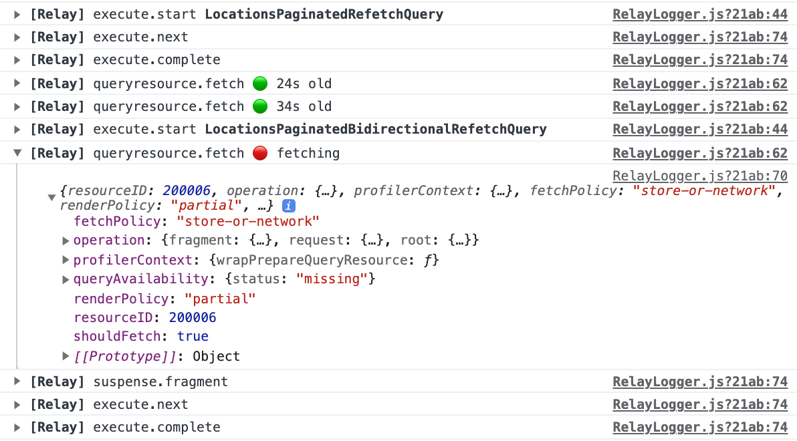

`@adeira/relay` is an opinionated wrapper around [`facebook/relay`](https://github.com/facebook/relay) - a JavaScript framework for building data-driven React applications. Goal of this package is to create powerful yet simple to use Relay wrapper with great DX and additional useful features:

- all under one rooftop (simpler installation and setup)
- network fetching with retries and timeouts (see [`@adeira/fetch`](https://github.com/adeira/universe/tree/master/src/fetch))
- support for [files uploading](#tip-3-file-uploading-via-graphql-mutations) via GraphQL mutations
- console query logging during development
- Relay compiler with ES6 output and source signing
- improved Flow types and sanity checks

More info about Relay, prior art:

- [Relay Docs](https://relay.dev/docs/)
- [Relay Modern Network Deep Dive](https://medium.com/entria/relay-modern-network-deep-dive-ec187629dfd3)
- [Advanced Relay topics](https://mrtnzlml.com/docs/relay)
- [Relay Example](https://github.com/adeira/relay-example)

# Installation and Setup

`@adeira/relay` is meant to be drop-in replacement for `facebook/relay` to ease migrations back and forth (it's just all hidden under one rooftop with small DX tweaks and improvements).

In case you are migrating from `facebook/relay`: uninstall _all_ the Relay related packages you installed manually (`babel-plugin-relay`, `react-relay`, `relay-compiler`, `relay-config` and `relay-runtime`). You should also remove custom `flow-typed` definitions for Relay. This package takes care about everything you need (only one dependency needed).

## Installation

```bash
yarn add react react-dom @adeira/relay
```

## Set up Relay with a single config file

Create a new file `relay.config.js` in your project root and configure where is your source code and GraphQL schema:

```js
module.exports = {
  // Configuration options accepted by the `relay-compiler` command-line tool and `babel-plugin-relay`.
  src: './src',
  schema: './data/schema.graphql',
};
```

## Set up babel-plugin-relay

Add "relay" to the list of plugins in your `.babelrc` file:

```json
{
  "plugins": ["relay"]
}
```

## Set up Relay Compiler

TKTK

# Usage

First, you should set up Relay Environment somewhere in the root of your application. We provide useful functions `createEnvironment` and `createNetworkFetcher` which will set up everything for you:

```js
import React from 'react';
import { createEnvironment, createNetworkFetcher } from '@adeira/relay';

function render() {
  const Environment = createEnvironment({
    fetchFn: createNetworkFetcher('https://graphql.example.com', {
      // … additional HTTP headers if you want …
    }),
  });

  return (
    <RelayEnvironmentProvider environment={Environment}>
      <React.Suspense fallback={'Loading…'}>{/* your React application here */}</React.Suspense>
    </RelayEnvironmentProvider>
  );
}
```

Now, you can start fetching data in your React application:

```js
import React from 'react';
import { graphql, useLazyLoadQuery } from '@adeira/relay';

export default function App(props) {
  const data = useLazyLoadQuery(graphql`
    query AppQuery {
      allLocations(first: 20) {
        edges {
          node {
            id
            name
          }
        }
      }
    }
  `);

  return (
    <ol>
      {data.allLocations?.edges?.map((edge) => (
        <li key={edge?.node?.id}>{edge?.node?.name}</li>
      ))}
    </ol>
  );
}
```

For more information on how to use Relay please follow the official Relay Guided Tour: [https://relay.dev/docs/guided-tour/](https://relay.dev/docs/guided-tour/)

Everything you find in the Relay Guided Tour should work with our drop-in replacement `@adeira/relay` (except you import everything from `@adeira/relay` package). Additionally, you can observe Relay logs in your dev console:



# Error handling

`@adeira/relay` forwards all successful responses (even when they are partial with errors) to the application code. This allows you to render the layout partially by getting the data via `useLazyLoadQuery` or in a callback `onCompleted` when calling a mutation.

Optionally, server can also specify whether the error is critical or not by sending a severity in the [error's `extensions` entry](https://spec.graphql.org/June2018/#sec-Response-Format):

```json5
{
  data: '…',
  errors: [
    {
      message: 'some critical server error message',
      locations: [{ line: 5, column: 5 }],
      path: ['commerce', 'products'],
      extensions: {
        severity: 'CRITICAL', // <<<
      },
    },
  ],
}
```

In this case, `@adeira/relay` will try to halt the application by throwing the error via `useLazyLoadQuery` (you should use an [ErrorBoundary](https://reactjs.org/docs/error-boundaries.html) to catch it) or by calling a callback `onError` when calling a mutation.

This is particularly useful in situations when server would return a partial response, however, the error is so severe that we should not even attempt to partially render it.

# Tips and tricks

## Tip 1: do not expose global Relay Environment

You should never import your custom environment directly when working with mutations or subscriptions. Try to prefer [`useMutation`](https://relay.dev/docs/api-reference/use-mutation/) hook if possible or get the environment via [`useRelayEnvironment`](https://relay.dev/docs/api-reference/use-relay-environment/) hook:

```js
import { useRelayEnvironment } from '@adeira/relay';

function Component() {
  const environment = useRelayEnvironment();

  const handler = useCallback(() => {
    // For example, can be used to pass the environment to functions that
    // require a Relay environment (not needed with `useMutation` hook).
    commitMutation(environment, …);
  }, [environment])

  return (…);
}
```

Only this way you can be sure that your mutation/subscription is using the correct environment.

## Tip 2: file uploading via GraphQL mutations

Apart from the actual mutation and variables, [`useMutation`](https://relay.dev/docs/api-reference/use-mutation/) hook accepts also `uploadables`. Uploadables is a [`UploadableMap`](https://relay.dev/docs/api-reference/commit-mutation/#type-uploadablemap) which is an object of [`File`](https://developer.mozilla.org/en-US/docs/Web/API/File)
or [`Blob`](https://developer.mozilla.org/en-US/docs/Web/API/Blob).

`@adeira/relay` will automatically send the request as `multipart/form-data` instead of `application/json` when it detects uploadables, so you don't have to worry about anything.
