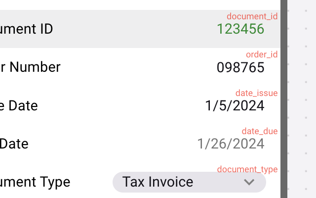
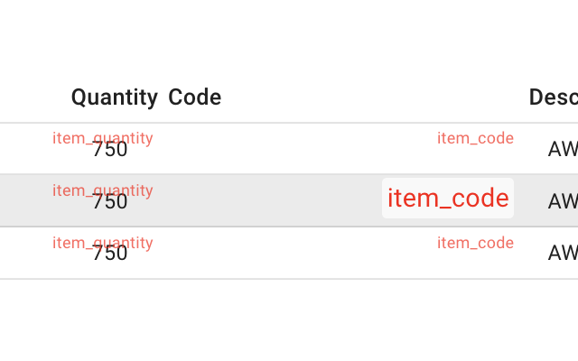

> [!IMPORTANT]
> This is a community project supported by enthusiasts and volunteers. For official support, please get in touch with [Rossum Sales](https://rossum.ai/form/contact/).

Chrome extension adding small enhancements to Rossum's UI (originally created by the SA team):

- shows datapoint `schema_id` on the annotation screen (headers and line items)
- adds `devFeatureEnabled` toggle

To publish:

- bump version in `manifest.json`, `package.json` and `popup/popup.html`
- ZIP the `rossum-sa-extension` folder
- https://chrome.google.com/webstore/devconsole
