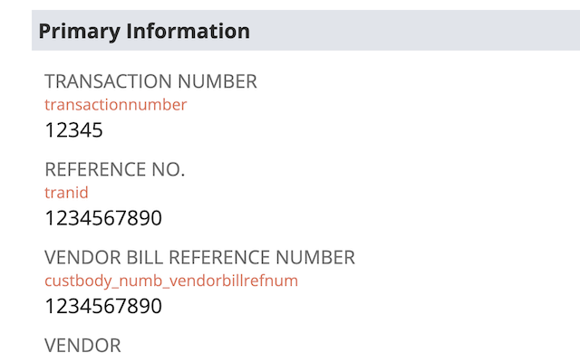

> [!IMPORTANT]
> This is a community project supported by enthusiasts and volunteers. For official support, please get in touch with [Rossum Sales](https://rossum.ai/form/contact/).

Chrome extension adds small enhancements to **Rossum UI** as well as **NetSuite UI** for easier onboarding (created by the SA team).

## Install

Head over to https://chrome.google.com/webstore/detail/bljkbinljmhdbipklfcljongikhmnneh and click **Add to Chrome**

## Rossum UI improvements

All of these options are configurable and can be turned on/off on demand:

- shows datapoint `schema_id` on the annotation screen (headers and line items)
- expands formula field definitions by default
- adds `devFeatureEnabled` toggle
- adds `devDebugEnabled` toggle

## NetSuite UI improvements

- shows field internal names where available

## Build and release

- bump version in `manifest.json`, `package.json` and `popup/popup.html`
- ZIP the `rossum-sa-extension` folder
- https://chrome.google.com/webstore/devconsole
